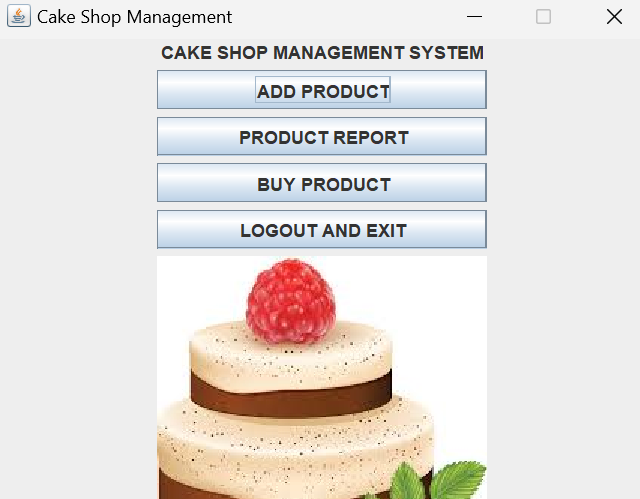

<h1 align="center"><strong><em>Cake Shop Management</strong></em></h1>

  
# How to run the app?

To run this application: 
 

* You have to have Java installed. You can download it here: <a href="https://www.java.com/en/">Link</a>
* After that clone the repository and run the app.

<h1 align="center"><strong>Demonstration</strong></h1>

